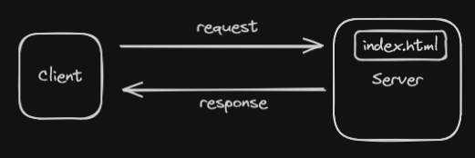

## Client - Server Interaction

### Static pages
- In static pages client request for a particular page or resources ➡ That page or resource is already present on the server ➡ The server sends the resource as response.

### Dynamic Pages
- Dynamic Pages are built at runtime ➡ Client requests a web page ➡ Server doesn't have that page right now. ➡ So we have to build the page. ➡ So the request goes to a helper application on the server ➡ This helper application is called WEB CONTAINER.
- In this Web Container we will have servlets.
- Servlets are java files which can take the request from the client on the internet and process that request and can provide a response in form of a html page.
- Various Web Containers : Tomcat, Glasssfish etc.
- The mapping of request to a particular servlet will be done using Deployment Descriptor file(web.xml)

> To bhai, request bhejenge ➡ dynamic page runtime pe build hota hai ➡ to server par ek helper app hoga ➡ WEB CONTAINER(Tomcat) ➡ Is web container me bahot saare servlets honge ➡ us request(ex: add.html) ke according ek servlet(ex: sum.java) hoga ➡ Wo request us servlet par jaayega ➡ servlet us request ko process karega ➡ then response send karega ➡ but kaun se request par kaun se servlet ko execute karna hai ye decide karna hoga ➡ iske liye ek special file hota hai DEPLOYMENT DESCRIPTOR