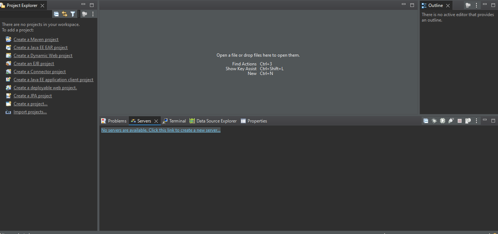
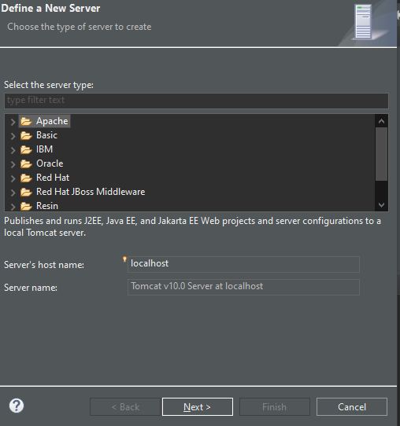
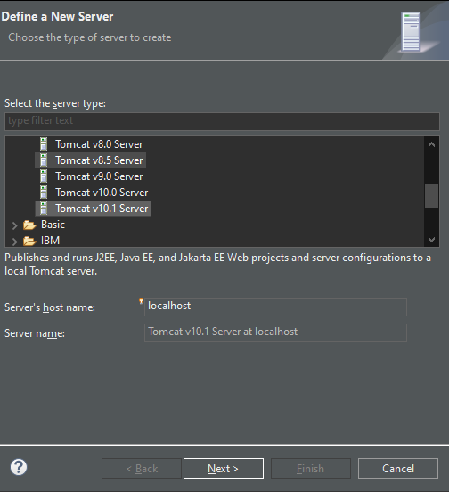
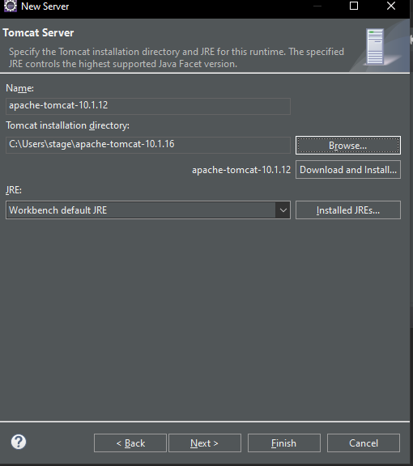
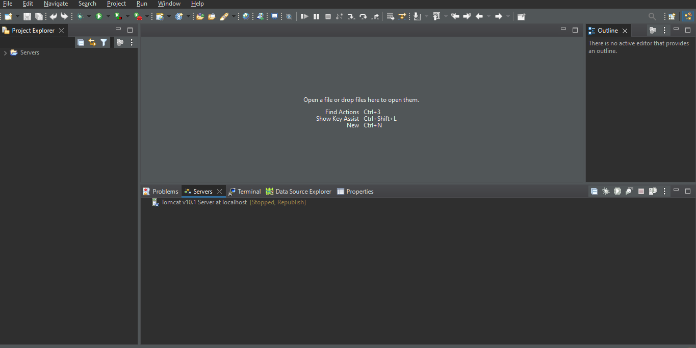
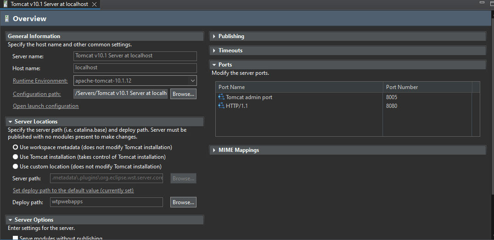
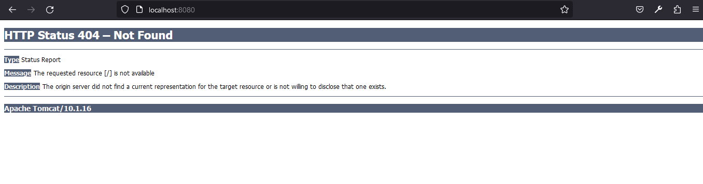

## Setup
- Download eclipse ide for JAVA EE
- Workspace - A folder where I will put all my projects
- Configure Tomcat
    - Download Tomcat
    - Extract if zip file
    - Click to add server
        
    - Click Apache
        
    - Select tomcat version we downloaded
        
    - Now provide the Tomcat directory location.
        
    - Finish and server created
        
    - Verify that it is running by right clicking and starting the server. Here it has started.
        
    - Sometimes, there may be an error due to port number being used by other application. 
    - In that case double click on the server, a window will open where we can change port number.
        
    - Go to browser and type localhost:8080 or your configured port number. You should see the following page.
        
    - And that's how eclipse and tomcat is configured.
