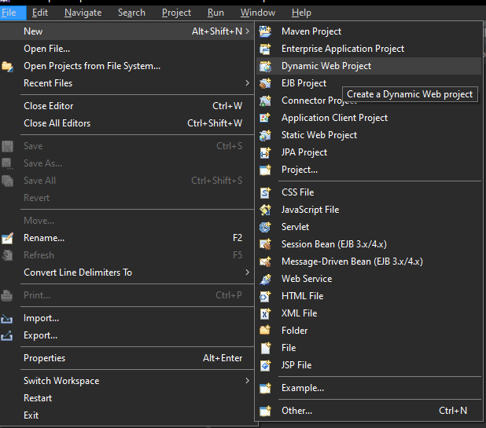
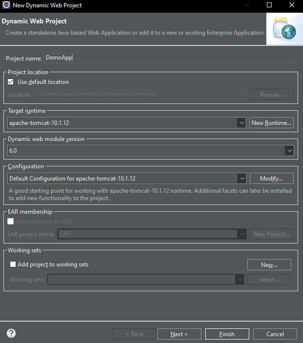
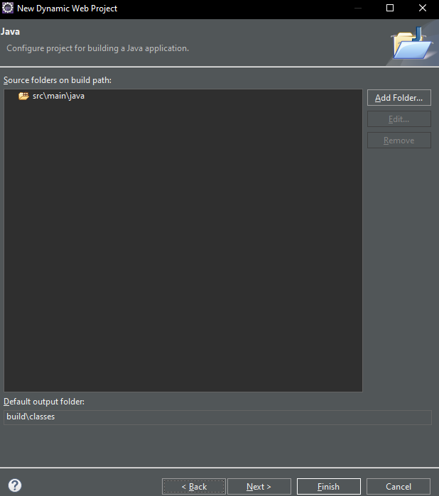
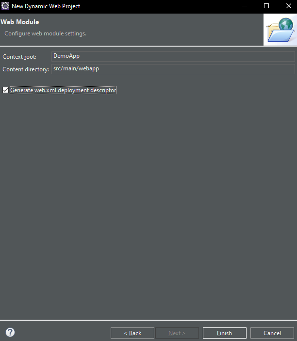
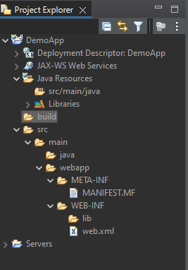

## Creating web project in Eclipse
- File - New - Dynamic Web Project
    
- Give project name, target runtime etc. Click Next
    
- Click Next
    
- Check 'Generate web.xml deployment descriptor'. Click Finish
    
- Directory Structure    
    
- In Java resources folder : We will create our servlets.
- In src - main - webapp : We will create web pages.
- Adding files in proper directories will be handled by Eclipse