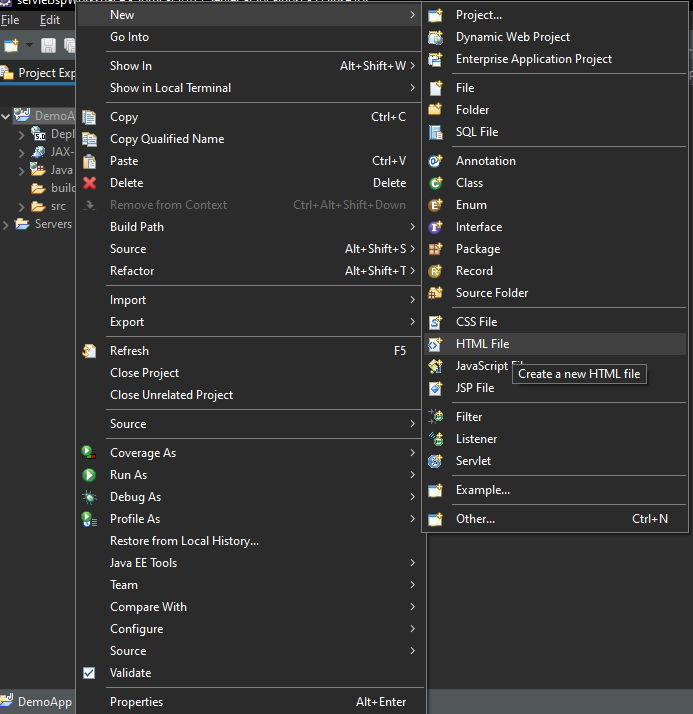
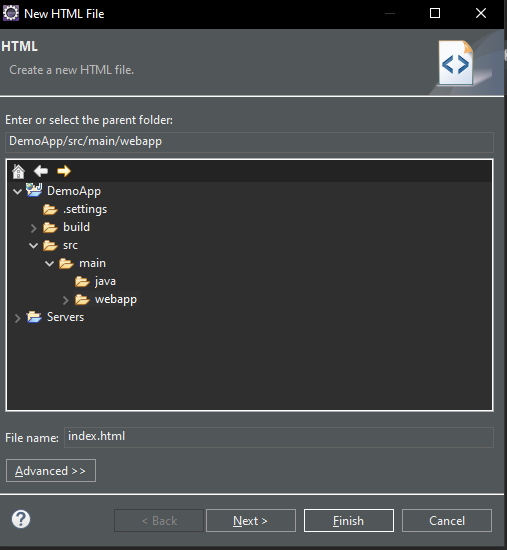
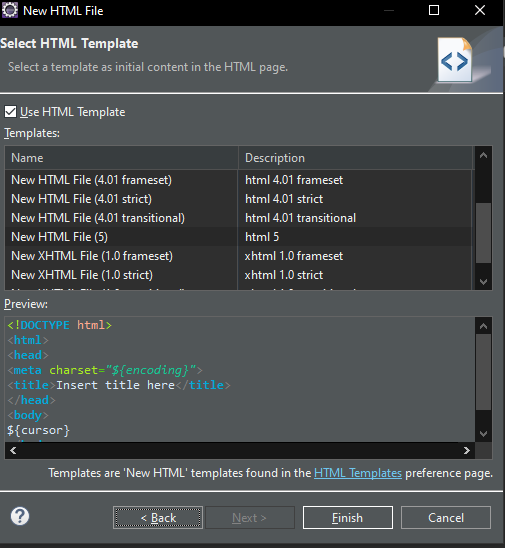
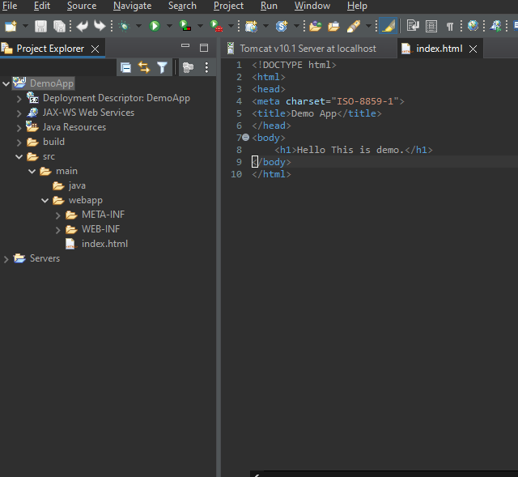
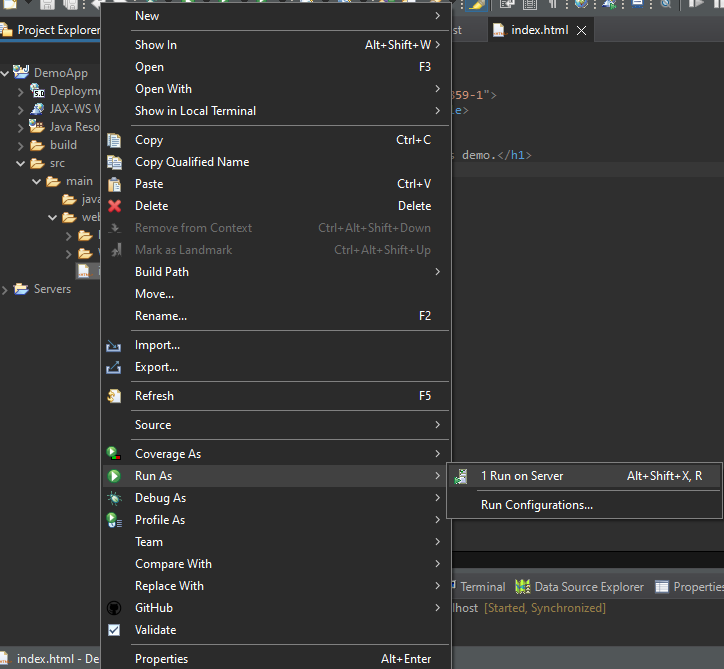
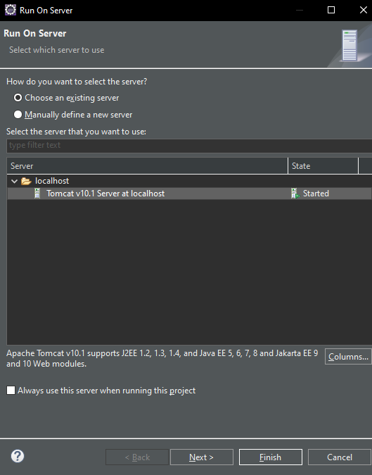
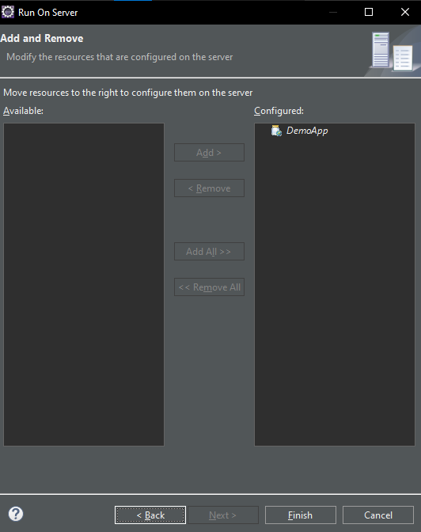
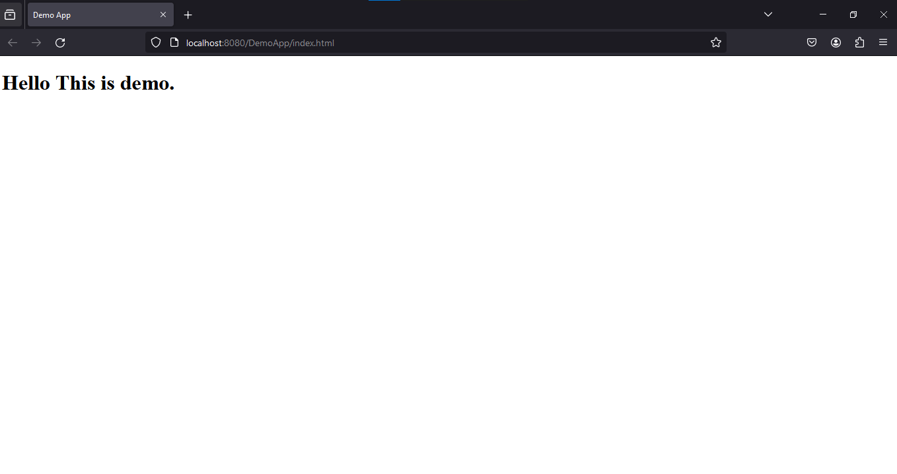
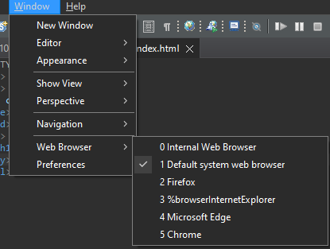

## Creating static page in web project
- Right click on the project directory - New - HTML file

- Name it

- Keep the following as provided - Finish

- The html file will be created in src - main - webapp folder. We can edit the html file.

- To open this file in browser: Right click on the html file - Run as - Run on server

- Choose Server - Next

- Automatically Configured - Finish

- Restart server if asked
- The following page will open

- The first time - the web page might get opened in Eclipse' own browser. We can change the browser by going to Window tab - Web broswer - Select desired browser.
