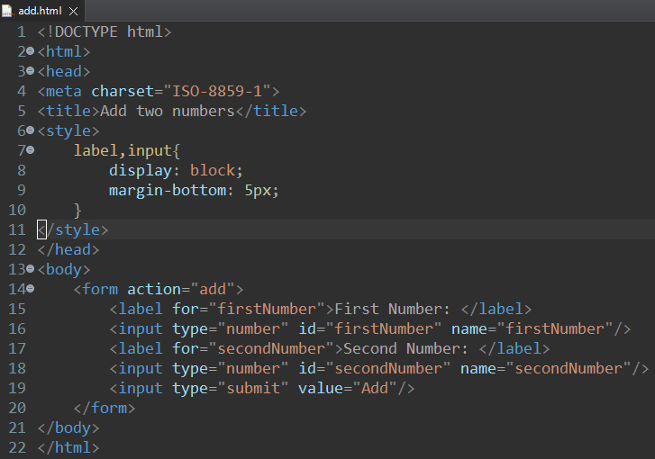
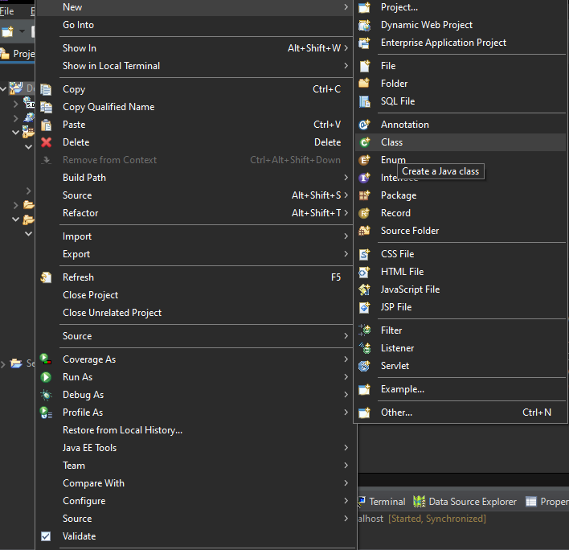
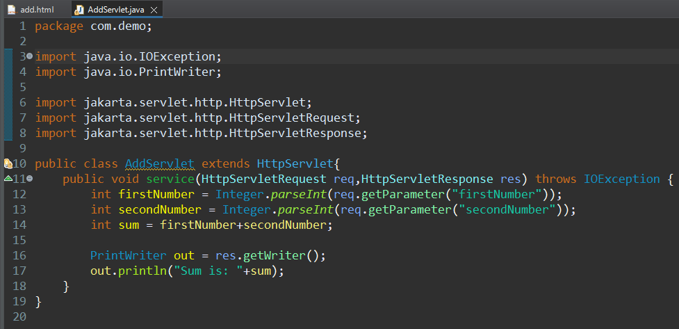
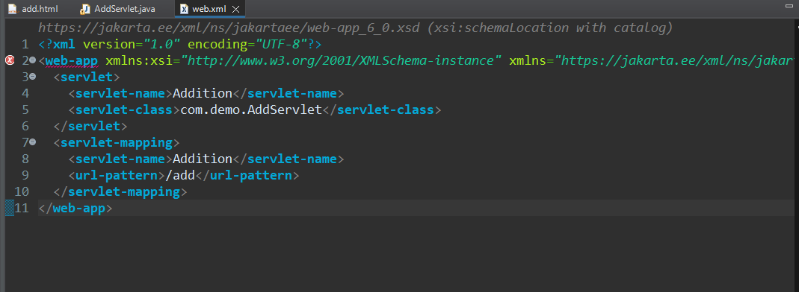

## Using servlets with html to add two numbers
1. Create an html page with two input box and a submit button.
    
2. Create a servlet 
    - Right click on project directory - New - Class
    
    - Give some class name and package name to your class.
3. Write logic in your java file 
    
4. Modify Deployment Descriptor file to map /add url to AddServlet.java
    
5. Run your html file on server and you should get your desired output.